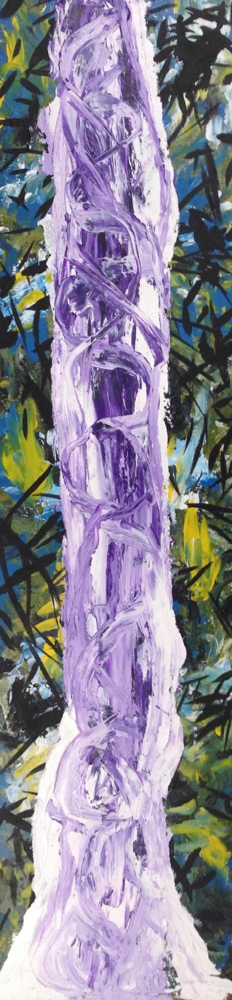
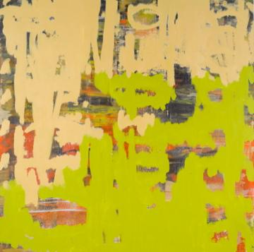

# Prairie Hill Learning Center

Rails application for [prairiehill.com](http://www.prairiehill.com)

## TODO 

-   [-] Sat Feb 13 18:47:52 CST 2016
    -   [X] hide camp page
    -   [ ] update camp page
        
        <https://docs.google.com/forms/d/1JBaU-LJ1JWzM0gm2X38Bra1qCFcgUpiLmATPu9CbkTI/viewform>
        
        <./config/routes.rb>
        
        <./app/views/pages/home.html.erb>
        
        <./app/views/pages/summer_camp.html.erb>
        
        ,-&#x2014;2016
        
        <table border="2" cellspacing="0" cellpadding="6" rules="groups" frame="hsides">
        
        
        <colgroup>
        <col  class="left" />
        </colgroup>
        <tbody>
        <tr>
        <td class="left">NatureWorks Summer Camps 2016</td>
        </tr>
        
        
        <tr>
        <td class="left">NatureWorks Summer Day Camps and Mini-camps 2016</td>
        </tr>
        
        
        <tr>
        <td class="left">&#xa0;</td>
        </tr>
        
        
        <tr>
        <td class="left">PRAIRIE HILL offers nature-centered day camp programs for children</td>
        </tr>
        
        
        <tr>
        <td class="left">(ages 6-9, 10-13, 14-15 and mini-camps for ages 3-6) on our</td>
        </tr>
        
        
        <tr>
        <td class="left">historic farm, just seven miles south of Lincoln, Nebraska.</td>
        </tr>
        
        
        <tr>
        <td class="left">&#xa0;</td>
        </tr>
        
        
        <tr>
        <td class="left">More Info Button (to full camp page)</td>
        </tr>
        
        
        <tr>
        <td class="left">&#xa0;</td>
        </tr>
        </tbody>
        </table>
        
        \`-&#x2014;
        
        ,-&#x2014;2015
        
        <table border="2" cellspacing="0" cellpadding="6" rules="groups" frame="hsides">
        
        
        <colgroup>
        <col  class="left" />
        </colgroup>
        <tbody>
        <tr>
        <td class="left">&#xa0;</td>
        </tr>
        
        
        <tr>
        <td class="left">NatureWorks Summer Day Camps and Mini-camps</td>
        </tr>
        
        
        <tr>
        <td class="left">&#xa0;</td>
        </tr>
        
        
        <tr>
        <td class="left">PRAIRIE HILL offers nature-centered day camp programs for children</td>
        </tr>
        
        
        <tr>
        <td class="left">(ages 6-9, 10-12,limited dates 12-15 and mini-camps for ages 3-6) on our</td>
        </tr>
        
        
        <tr>
        <td class="left">historic farm, just seven miles south of Lincoln, Nebraska.</td>
        </tr>
        
        
        <tr>
        <td class="left">&#xa0;</td>
        </tr>
        
        
        <tr>
        <td class="left">Summer Camps are full for this year. Please plan to join us for our</td>
        </tr>
        
        
        <tr>
        <td class="left">Children's Country Fair and "Little Run on the Prairie" children's fun</td>
        </tr>
        
        
        <tr>
        <td class="left">run on Saturday, October 3rd. Run starts at 10:30am and Fair from 11-3.</td>
        </tr>
        
        
        <tr>
        <td class="left">Check back for updates and details!</td>
        </tr>
        
        
        <tr>
        <td class="left">&#xa0;</td>
        </tr>
        </tbody>
        </table>
        
        \`-&#x2014;

    <h1 class="tour-dates" style="font-size: 4vw;"><strong>NatureWorks Summer Day Camps and Mini-camps </strong></h1>
    

      PRAIRIE HILL offers nature-centered day camp programs for children (ages 6-9, 10-12,limited dates 12-15 and mini-camps for ages 3-6) on our historic farm, just seven miles south of Lincoln, Nebraska.
    

    

      <em>Summer Camps are full for this year</em>. Please plan to join us for our <strong>Children's Country Fair and "Little Run on the Prairie" children's fun run on Saturday, October 3rd. Run starts at 10:30am and Fair from 11-3</strong>. Check back for updates and details! 
    

    

    

      <a class="hidden camp-link" href="https://docs.google.com/forms/d/1bXdH8JeozdZy8447xA8P-PVWVGh2cUJDsT36JYtSIu8/viewform?c=0&amp;w=1">NatureWorks - Registration Form </a>
    

    <h2 class="camp-title">Survival and Awareness -- with BJ Spring</h2>
    <h3 class="camp-title">June 1-12</h3>
    

      One of PRAIRIE HILL's favorite camps (offered for a rare two-week session), campers will develop their skills in nature through fox-walking, building primitive shelters, awareness and sensory exercises, basket/rope making, and much more...
    

    <h2 class="camp-title">What's the Story?</h2>
    <h3 class="camp-title">June 15 - 26 
    </h3>
    

      This two-week camp will be lead by storytellers and writers from various walks of life. Storytelling is a way to learn about culture, life &amp; death, growth, adventure, and moral dilemmas across space and time. Campers will hear engaging stories that weave together mythology, history, fiction and non-fiction. They will also have opportunities to write their own legends.
    

    <h2 class="camp-title">Suzuki Violin Camp</h2>
    <h3 class="camp-title">July 6-10</h3>
    

      Suzuki violin players from ages 3-15 are welcome to come play in the prairie with us! Small group lessons will take place throughout the day from experienced violin instructors and tutors. Pony riding, gardening, and exploring on the farm are also a part of the experience. Half-day or full-day options are available for this session.
    

    <h2 class="camp-title">Simple Machines and Complex Creations</h2>
    <h3 class="camp-title">July 13-24</h3>
    

      "Never give more to the mind than to the hand." is a quote that Maria Montessori used when writing about children. This session will give plenty of opportunities for the mind and the hand to work together to create and understand simple machines like the pulley, inclined plane, wheel-and-axel and more. There will also be opportunities to engage in creating unique art forms using these concepts and others. 
       
    

    <h2 class="camp-title">Animal Encounters</h2>
    <h3 class="camp-title">July 27-31</h3>
    

      This one-week science camp will be led by UNL professor, Eileen Hebets, who has headed up the Eight-legged Encounters event at Morrill Hall for the past several years. Children will observe and interact with a variety of animals during this camp, and will experience the scientific methods of questioning, observing, hypothesis, drawing conclusions, etc.
    

    <h2 class="camp-title">Mini-camps for children ages 3-6</h2>
    

      Each two-week session consists of six wonder-filled days (Tuesday-Thursday, Tuesday-Thursday). Your child will enjoy a rich, natural PRAIRIE HILL experience through gardening, leisurely walks in the pasture, egg-gathering, pony rides, building shelters in the woods, singing, stories, and much more. A lunch from home will taste delicious in the shade of our picnic area!
    

    

       <strong> <a href="https://docs.google.com/forms/d/1JgJvfvQlzrz_14qwm32E80YxnDHjg2hNF2e_NPf6fkA/viewform?c=0&amp;w=1" class="hidden">Mini-Camp PRAIRIE HILL - Registration Form </a> </strong> 
    

    <h3 style="text-align: left;"><strong><u data-redactor-tag="u">Camp PRAIRIE HILL Daily Schedule</u> *</strong></h3>
    

      <table>
        <thead>
          <tr>
            <th>
            </th>
            <th>
            </th>
          </tr>
        </thead>
        <tbody>
          <tr>
            <td>
              <strong>9:00 a.m.</strong>
            </td>
            <td>
              Drop-off: greeting and getting ready for the day
            </td>
          </tr>
          <tr>
            <td>
              <strong> 9:15 a.m.</strong>
            </td>
            <td>
              Circle Time: flag raising, songs, movement games
            </td>
          </tr>
          <tr>
            <td>
              <strong> 9:30 a.m.</strong>
            </td>
            <td>
              Garden Time/Nature Walk
            </td>
          </tr>
          <tr>
            <td>
              <strong> 10:15 a.m.</strong>
            </td>
            <td>
              Pony Rides
            </td>
          </tr>
          <tr>
            <td>
              <strong> 11:15 a.m.</strong>
            </td>
            <td>
              Lunch Preparation/Story Time
            </td>
          </tr>
          <tr>
            <td>
              <strong> 11:30 a.m.</strong>
            </td>
            <td>
              Picnic Lunch
            </td>
          </tr>
          <tr>
            <td>
              <strong> 12:15 p.m.</strong>
            </td>
            <td>
              Prepare for Pickup (12:30 p.m.)
            </td>
          </tr>
        </tbody>
      </table>
      

      <address><strong><em data-redactor-tag="em">*Schedule may vary depending on more time devoted to . . . watching a caterpillar crawl across a leaf . . . feeling the morning breeze in the meadow . . . picking juicy cherries in the orchard . . . enjoying a longer ride on Dolly, the Shetland . . . or, well . . . you get the idea.</em></strong></address><address> </address><address>All camps at PRAIRIE HILL include daily pony riding, gardening, singing, walks in the pasture, animal care, story-telling, snacks, picnics, and more. Call 402-438-6668 for more information.</address><address> </address><address>Please join us for a family picnic on Friday evening on June 5th, 19th and July 17th.</address>
    

    

      <%#= cms_snippet_content('summer-camp', @cms_site).html_safe %>
    

    

    
      

        

          Summer Camp 2016 Coming Soon!
        

    
        

          <%#= cms_snippet_content('summer-camp', @cms_site).html_safe %>
        

    
      

    

-   [ ] design
    -   [ ] color ideas
        
        
        
        b3ad35, ea8329, 6f672b, f9dabf, fedd3a, 963225
    -   [ ] make registration link to button

-   [ ] create tabs and front page news
    
    <./app/views/pages/home.html.erb>
    
    <./app/views/pages/_camp_brief.html.erb>
    
    <./app/assets/stylesheets/bootstrap_and_customization.css.scss>
    
    -   [ ] ready for links to google forms etc

-   [ ] Sun Oct 11 11:53:19 CDT 2015
    -   [ ] gather user feedback
        -   [ ] survey
            -   [ ] delivery methods
                -   [ ] email
                -   [ ] rails engine
                    -   [ ] <https://github.com/runtimerevolution/survey>
            -   [ ] elements
                -   [ ] 5 tips for writing a great survey
                    
                    <http://help.surveymonkey.com/articles/en_US/kb/5-Tips-for-Writing-a-Great-Survey>
                    
                    Be Thankful!
                    
                    -   [ ] Define Your Objectives. 
                        
                        Figure out the decision or decisions you're trying to make to 
                        focus your survey.   
                        
                        -   [ ] Objectives
                            -   collect user feedback in order to understand
                                -   what worked? what didn't work?
                                -   how did the site feel?
                                -   browser and system type?
                            
                            -   improve the application based on this feedback
                    
                    -   [ ] Work Backwards. 
                        
                        Once you've set your objectives, determine the data you need to 
                        gather in your survey to make your decision.
                        
                        -   [ ] data needed
                            -   comments, textual feedback
                                
                                What's good, what could be better, and how?
                                
                                -   general
                                    -   look & feel
                                    -   functionality
                                        -   what worked?
                                        -   what did not work?
                    
                    -   [ ] Check for Bias. 
                        
                        Make sure you're not asking leading questions.
                    
                    -   [ ] Do a Test Drive. 
                        
                        Send your survey to friends and colleagues for a test run. 
                        They'll help make sure your questions and response options are 
                        understandable and all your survey logic works.
                    
                    -   [ ] Collect Results and Analyze Data. 
                        
                        This is where it gets really fun. The data rolling in from your 
                        survey should help you decide what product to launch next, how 
                        to raise more money at your next fundraiser, what to do to keep 
                        customers coming back, what to serve at your next party and much 
                        more.
    -   [ ] create special event section
        -   [ ] section for LUX art event
            -   Event MVC
                <./app/models/event.rb>
                <./app/helpers/events_helper.rb>
                <./app/helpers/application_helper.rb>
                <./app/views/events>
                <./app/views/layouts/>
                <./app/controllers/events_controller.rb>
                -   add condition to account for past events
                    -   display past events for information purposes
                        -   past events view
        -   [ ] details in email from Mandie
            
            
            [original document](docs/ArtAuctionbyChrisRudasilltobenifittPrairieHill.docx.txt)
            
            *Art Auction to Benefit PRAIRIE HILL*
            
            Local artist and PRAIRIE HILL dad Chris Rudasill is donating 
            several pieces of his original artwork to be sold in a silent 
            auction. 100% of the profits will go directly to the further 
            funding of art materials and enrichment opportunities at PRAIRIE  
            HILL. 
            
            Don’t miss this great opportunity to see and purchase original artwork 
            at accessible prices (some starting bids will be as low as $10) while 
            supporting education through year-round and summer camp programming at 
            PRAIRIE HILL Learning Center.
            
            -   Silent auction during First Friday 
                -   11/6/15 (November 6)
                    -   5–8 p.m.
            -   Lux Center for the Arts 
                -   2601 N 48th St, Lincoln, NE 68504
            
            For more information and images of Chris’s artwork, visit: 
            [chrisrudasill.weebly.com](http://chrisrudasill.weebly.com)   
            
            For more info about PRAIRIE HILL, visit:   
            [prairiehill.com](http://prairiehill.com)
            
            
            
            
    
    -   [ ] upgrade heroku dyno
    -   [ ] design for mobile
        -   [ ] consider building separate mobile site to learn Angular, making 
            ajax calls to the current phill api
            
            <file:///home/son/bin/js/angular/learnAngular/README.md>
    
    -   [ ] update staff page
        -   [ ] waiting for updates from Mandie
    -   [ ] hide ccf section until 2016
        -   [ ] backup database

-   [-] Wed Oct  7 10:35:18 CDT 2015
    -   [-] hide ccf section until 2016
        -   [X] keep open/accessible by path for portfolio demo
        -   [X] hide links to ccf
            
            <./app/views/layouts/_static_menu.html.erb>
        
        -   [X] remove from slides
            
            <./app/views/pages/home.html.erb>
        
        -   [ ] backup database
        -   [ ] prevent modification?
    -   [ ] create special event section
        -   [ ] section for LUX art event
        -   [ ] details in email from Mandie
    -   [-] update staff page
        -   [X] substitute staff page with coming soon page
            
            <./app/views/pages/staff.html.erb>
        
        -   [ ] wait for updates from Mandie
    -   [ ] design for mobile
    -   [ ] upgrade heroku dyno

## Configuration

### Gems

<./Gemfile>

    source 'http://rubygems.org'
    ruby '2.3.1'
    
    gem 'rails', '4.2.6'
    gem 'sass-rails', '>= 3.2'
    gem 'compass-rails', '~> 2.0.alpha.0'
    gem 'uglifier', '2.5.1'
    gem 'coffee-rails', '4.0.1'
    gem 'jquery-rails', '3.1.1'
    gem 'jquery-ui-rails'
    gem 'jbuilder'
    gem 'kaminari'
    gem 'responders'
    gem 'bcrypt'
    gem 'devise'
    gem 'pg'
    gem 'comfortable_mexican_sofa', '1.12.7'
    gem 'sdoc', '~> 0.4.0',          group: :doc
    #gem 'paperclip', '~> 4.3'
    gem 'paperclip', :git => 'https://github.com/thoughtbot/paperclip', :ref => '523bd46c768226893f23889079a7aa9c73b57d68'
    #gem 'aws-sdk', '~>2'
    gem 'aws-sdk'
    gem 'mail_form'
    gem 'simple_form'
    gem 'inherited_resources', github: 'josevalim/inherited_resources', branch: 'rails-4-2'
    gem 'skrollr-rails'
    gem 'rails_admin'
    gem 'picturefill'
    gem 'autoprefixer-rails'
    gem 'chronic'
    gem 'acts_as_xlsx'
    gem 'axlsx'
    gem 'axlsx_rails'
    gem 'rubyzip'
    gem 'writeexcel', '1.0.5'
    gem 'figaro'
    gem 'meta-tags'
    gem 'metamagic'
    gem 'safe_yaml', '1.0.4'
    gem 'sitemap_generator'
    gem 'dynamic_sitemaps'
    gem 'fullcalendar-rails'
    gem 'momentjs-rails'
    gem 'jquery-datetimepicker-rails'
    gem 'cocoon'
    gem 'turbolinks'
    gem 'jquery-turbolinks'
    gem 'masonry-rails'
    gem 'omniauth', '~> 1.2.2'
    gem 'omniauth-google-oauth2'
    gem 'json'
    gem 'instagramjs-rails'
    #gem 'will_paginate', '~> 3.0.6'
    gem 'dalli'
    gem 'foundation-rails'
    gem 'foundation-icons-sass-rails'
    gem 'jquery-slick-rails'
    gem 'koala', '~> 2.2'
    gem 'jquery-scrollto-rails'
    gem 'font_assets'
    gem 'font-awesome-rails'
    gem 'cancancan', '~> 1.10'
    #gem 'refile', require: 'refile/rails'
    #gem 'refile-mini_magick'
    #gem 'refile-s3'
    gem 'dotenv-rails', :groups => [:development, :test]
    #gem 'nicescroll-rails'
    gem 'jscrollpane-rails'
    
    # Spring speeds up development by keeping your application running in the background. Read more: https://github.com/rails/spring
    gem 'spring',        group: :development
    
    group :development, :test do
      gem 'byebug'
      gem 'sqlite3'
      gem 'foreman'
      gem 'pry-rails'
      gem 'unicorn'
      gem 'rails-dev-tweaks', '~> 1.1'
    end
    
    group :production do
      gem 'rails_12factor'
      gem 'unicorn-rails'
    end

## Events

    rails g scaffold Event title:string subtitle:string location:string \ 
    location_address:text date_and_time:datetime parent:string \
    description:text links:text event_image_id:string

    rake db:migrate

<./config/routes.rb>
<./app/models/ability.rb>
<./app/controllers>
<./app/controllers/events_controller.rb>

    def new
      @event = Event.new
      authorize! :manage, @event
    end

    <%= if.can? :manage, @event %>
      <%= link_to "Edit", edit_event_path(@event) %>
    <%= end %>

-   [ ] image file upload(s)
    
    PaperClip
    
    <https://github.com/thoughtbot/paperclip/issues/2021>
    
    <./Gemfile>
    
        gem 'paperclip', :git => 'https://github.com/thoughtbot/paperclip', :ref => '523bd46c768226893f23889079a7aa9c73b57d68'
    
    ::::::::::::::::::::::::::::::::::::
    Refile Below, not quite successful yet
    
    <https://github.com/refile/refile>
    
    -   [ ] to S3
        
        <./Gemfile>
        
            gem "refile", require: "refile/rails"
            gem "refile-mini_magick"
        
        <./app/models/event.rb>
        
            Class Event < ActiveRecord::Base
              attachment :event_image
            end
        
        <./app/views/events>
        <./app/views/events/_form.html.erb>
        <./app/views/events/_form.html.haml>
        
            <%= form_for @event do |event| %>
            ...
              <%= form.attachment_field :event_image %>
            ...
            <% end %>
        
        <./app/controllers/events_controller.rb>
        
            def event_params
              params.require(:event).permit(... :event_image, ...)
            end
        
        <./app/views/events/show.html.erb>
        <./app/views/events/show.html.haml>
        
            <%= image_tag attachment_url(@event, :event_image, :fill, 300, 300, format: "jpg") %>
        
        -   [ ] s3
            
            <./Gemfile>
            
                gem 'aws-sdk', '~>2'
                gem 'refile-s3'
            
            <./config/environments/production.rb>
            <./config/initializers/refile.rb>
            
                require 'refile/s3'
                
                aws = {
                  access_key_id: ENV['AWS_ACCESS_KEY_ID'],
                  secret_access_key: ENV['AWS_SECRET_ACCESS_KEY'],
                  bucket: ENV['AWS_BUCKET']
                }
                Refile.cache = Refile::S3.new(prefix: 'cache', **aws)
                Refile.store = Refile::S3.new(prefix: 'store', **aws)

### Chris Rudasill benefit (event)

[original document](docs/ArtAuctionbyChrisRudasilltobenifittPrairieHill.docx.txt)

*Art Auction to Benefit PRAIRIE HILL*

Local artist and PRAIRIE HILL dad Chris Rudasill is donating 
several pieces of his original artwork to be sold in a silent 
auction. 100% of the profits will go directly to the further 
funding of art materials and enrichment opportunities at PRAIRIE  
HILL. 

Don’t miss this great opportunity to see and purchase original artwork 
at accessible prices (some starting bids will be as low as $10) while 
supporting education through year-round and summer camp programming at 
PRAIRIE HILL Learning Center.

-   Silent auction during First Friday 
    -   11/6/15 (November 6)
        -   5–8 p.m.
-   Lux Center for the Arts 
    -   2601 N 48th St, Lincoln, NE 68504

For more information and images of Chris’s artwork, visit: 
[chrisrudasill.weebly.com](http://chrisrudasill.weebly.com)   

For more info about PRAIRIE HILL, visit:   
[prairiehill.com](http://prairiehill.com)

## Styles

<./app/assets/stylesheets>
